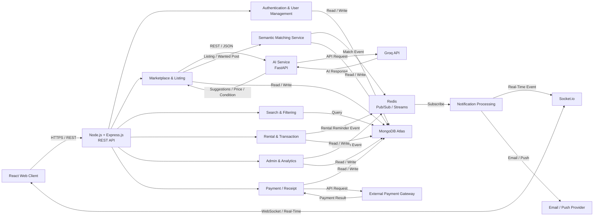
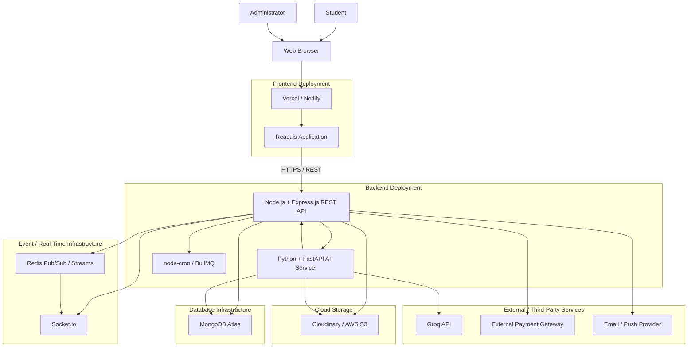

# CampusConnect — System Architecture

## 1. Architecture Overview

CampusConnect employs a service-oriented, modular architecture designed to support secure, real-time campus exchanges. The system is built on the MERN stack (MongoDB, Express.js, React.js, Node.js) and integrates an intelligent AI service powered by FastAPI and Groq API. Real-time communication and asynchronous event processing are facilitated via Socket.io and Redis. This architecture ensures loose coupling between core transaction modules, event-driven processes, and intelligent services, delivering a scalable and maintainable solution for the university community.

## 2. High-Level System Architecture

The following diagram illustrates the major layers and logical modules within CampusConnect. It demonstrates how users interact with the React.js web clients, which communicate with a monolithic Node.js core backend encompassing various distinct modules (Authentication, Marketplace, Rental, etc.). This backend interfaces with specialized supporting services like the FastAPI-based AI service, real-time message layers, and cloud infrastructure.

```mermaid
flowchart TD

    %% =========================
    %% USERS
    %% =========================

    Student["Student"]
    Admin["Administrator"]

    %% =========================
    %% CLIENT LAYER
    %% =========================

    subgraph ClientLayer["Presentation Layer"]
        StudentWeb["Student Web Client<br/>React.js"]
        AdminWeb["Admin Web Client<br/>React.js"]
    end

    Student --> StudentWeb
    Admin --> AdminWeb

    %% =========================
    %% CORE BACKEND
    %% =========================

    subgraph Backend["Core Backend / API Layer<br/>Node.js + Express.js"]
        Auth["Authentication & User Management<br/>JWT / bcrypt / RBAC"]
        Marketplace["Marketplace & Listing Management"]
        Search["Search & Filtering"]
        Rental["Rental & Transaction Management"]
        AdminModule["Admin Panel & Analytics"]
        Payment["Payment & Receipt Management"]
        Reputation["Ratings & Reputation"]
        Sustainability["Sustainability Dashboard"]
    end

    StudentWeb -->|"HTTPS / REST API"| Auth
    StudentWeb -->|"HTTPS / REST API"| Marketplace
    StudentWeb -->|"HTTPS / REST API"| Search
    StudentWeb -->|"HTTPS / REST API"| Rental
    StudentWeb -->|"HTTPS / REST API"| Payment

    AdminWeb -->|"HTTPS / REST API"| Auth
    AdminWeb -->|"HTTPS / REST API"| AdminModule

    Auth --> Marketplace
    Auth --> Rental
    Auth --> Payment
    Auth --> AdminModule
    Auth --> Reputation
    Auth --> Sustainability

    Marketplace --> Search
    Marketplace --> Rental
    Payment --> Rental
    Reputation --> Payment
    Sustainability --> Payment

    %% =========================
    %% AI & INTELLIGENT SERVICES
    %% =========================

    subgraph IntelligentServices["AI & Intelligent Services"]
        AI["AI Listing Service<br/>Python + FastAPI"]
        Matching["Semantic Matching Service<br/>Node.js / Python + Embeddings"]
        OCR["OCR / Duplicate Detection"]
    end

    Marketplace -->|"Versioned REST API"| AI
    Marketplace -->|"Listing / Wanted Post Data"| Matching
    Marketplace -->|"Document Check"| OCR

    %% =========================
    %% EVENT / REAL-TIME LAYER
    %% =========================

    subgraph EventLayer["Event & Real-Time Layer"]
        Redis["Redis<br/>Pub/Sub / Streams"]
        Socket["Socket.io<br/>Real-Time Communication"]
        Notifications["Notification Processing"]
        Scheduler["Scheduler<br/>node-cron / BullMQ"]
    end

    Matching -->|"Match Event"| Redis
    Rental -->|"Due-Date Event"| Redis
    AdminModule -->|"Moderation Event"| Redis
    Socket <-->|"Real-Time Messages"| StudentWeb
    Redis --> Notifications
    Notifications --> Socket
    Notifications -->|"Email / Push"| ExternalNotify["Email / Push Provider"]
    Scheduler --> Redis

    %% =========================
    %% DATA LAYER
    %% =========================

    subgraph DataLayer["Data & Storage Layer"]
        Mongo["MongoDB / MongoDB Atlas"]
        Storage["Cloud Storage<br/>Cloudinary / AWS S3"]
    end

    Auth --> Mongo
    Marketplace --> Mongo
    Search --> Mongo
    Rental --> Mongo
    Payment --> Mongo
    AdminModule --> Mongo
    Reputation --> Mongo
    Sustainability --> Mongo
    Matching --> Mongo
    Notifications --> Mongo

    Marketplace --> Storage
    OCR --> Storage

    %% =========================
    %% EXTERNAL SERVICES
    %% =========================

    subgraph External["External / Third-Party Services"]
        Groq["Groq API"]
        PaymentGateway["External Payment Gateway"]
        ExternalNotify
    end

    AI --> Groq
    Payment --> PaymentGateway
```

## 3. SOA / Service Interaction Architecture

This view focuses on the communication patterns between the system's independent services and core logical modules. It highlights the use of synchronous REST APIs for immediate operations and asynchronous event-driven flows for background processing (such as notifications and matching).

**Service Communication Principles:**
- **Synchronous REST:** The primary communication channel between the React Web Client and the Core API, as well as from the Core API to the AI Service and External Payment Gateway.
- **Asynchronous Events:** The Semantic Matching, Rental, and Admin modules publish events to Redis (Pub/Sub or Streams). A detached Notification Processing service subscribes to these events to trigger email/push notifications or real-time Socket.io messages.
- **Clear Service Boundaries:** The AI Service is decoupled from the main Node.js application, allowing it to scale independently and interact with external APIs (like Groq) without blocking core marketplace transactions.

## 4. Deployment Architecture

The deployment architecture outlines where each component of CampusConnect is hosted, emphasizing cloud-native, scalable solutions identified in the project plans.

**Deployment Strategy:**
- **Frontend Deployment:** Hosted on Vercel or Netlify for edge-optimized delivery of the React applications.
- **Backend Deployment:** Deployed on Render or AWS EC2, hosting the Node.js API, FastAPI AI service, and the background task scheduler.
- **Data & Events:** Database persistence is managed by MongoDB Atlas, while Redis handles the event bus and Socket.io manages WebSocket connections. Cloudinary or AWS S3 provides distributed storage for media assets.

## 5. Architectural Principles

- **Separation of Concerns:** Distinct separation between presentation, core business logic, intelligent processing, and data persistence.
- **Service Orientation:** Encapsulating specific capabilities (like AI analysis and notifications) into dedicated services with well-defined APIs.
- **Loose Coupling:** Using Redis as an event bus to decouple the generation of events (e.g., a match being found) from the consumption (e.g., sending an email).
- **REST-Based Communication:** Utilizing standard HTTP methods and JSON for reliable and stateless interactions between the client and backend.
- **Real-Time Responsiveness:** Integrating Socket.io to push real-time updates directly to the client without polling.
- **Security:** Enforcing JWT authentication, university-email verification, and RBAC to secure endpoints and data.
- **Scalability & Maintainability:** The architecture enables components (e.g., Redis layer, MongoDB, or FastAPI service) to be scaled or modified independently as demand fluctuates.
